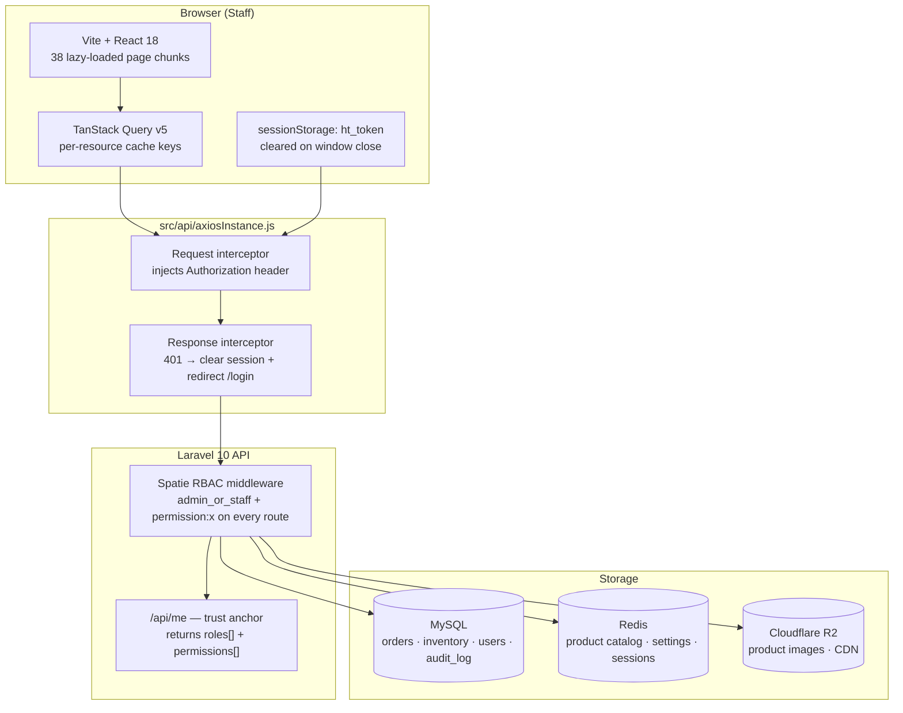
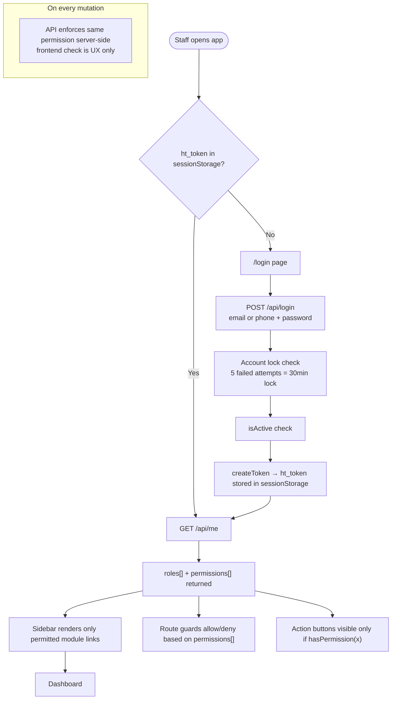

# Hometex IMS — Inventory & Operations Dashboard

Admin dashboard for Hometex Bangladesh, a multi-branch home textile retail business. Handles inventory, POS, order management, staff RBAC, and analytics across 19 modules — built for 5 concurrent staff roles with 53 granular permissions enforced live from the API.

**Related repositories:**
- Backend API: [hometex-api](https://github.com/ShahriarHim/hometex-api) — Laravel 10 + Sanctum, shared by both frontends
- Customer storefront: [hometex-ecom](https://github.com/ShahriarHim/hometex-ecom) — Next.js 16, same API, different namespace

---

## The Engineering Problem

The client ran a growing home textile operation across multiple branches with no centralized system. Inventory was tracked in Excel, order approvals happened over WhatsApp, and warehouse staff had the same system access as the owner. Stock discrepancies caused order fulfillment failures and there was no audit trail when inventory went missing.

The engineering challenge was not just "build an admin panel" — it was building one that enforces role boundaries where a warehouse user in Branch A literally cannot query Branch B's data, where permission changes propagate without requiring users to re-login, and where a non-technical counter staff member can process a POS sale in under a minute.

---

## System Architecture



---

## Auth and Permission Flow



---

## Tech Stack

| Layer | Choice | Why |
|---|---|---|
| Framework | Vite 5 + React 18 | Project migrated from CRA — Vite's sub-second HMR was essential during active development of 19 modules where CRA's 8–15s rebuild cycle was blocking |
| Data fetching | TanStack Query v5 | Server state is the bulk of this app — no global store needed. Per-resource `staleTime` and targeted `invalidateQueries` on the exact key shape eliminated entire categories of stale-data bugs |
| HTTP | Axios (single shared instance) | Needed a request interceptor to inject Bearer tokens and a response interceptor to handle global 401 redirects — not possible with bare `fetch` without wrapping it entirely |
| UI | Bootstrap 5 + React-Bootstrap + custom SCSS | The team was already familiar with Bootstrap; custom SCSS handles the app shell, sidebar, and dashboard cards where Bootstrap's grid doesn't fit the design |
| Auth token storage | sessionStorage | localStorage is XSS-vulnerable and persists across browser restarts. sessionStorage is cleared on window close and not shared across tabs — the safe intermediate step before httpOnly Sanctum cookies |
| RBAC | Spatie Laravel Permission via `/api/me` | Permissions are fetched live on session start, not decoded from a token. A revoked permission takes effect on the next page load without requiring logout |
| HTML sanitization | DOMPurify via `SafeHtml` component | Product descriptions are stored as rich text. All server-provided HTML passes through DOMPurify with an explicit tag/attribute allowlist — `dangerouslySetInnerHTML` appears nowhere else in the codebase |
| Error monitoring | Sentry (gated on `VITE_SENTRY_DSN`) | Conditional on env var — zero-cost no-op in development, active in production without a code change |
| Barcode | react-barcode + react-to-print | In-browser label generation and direct browser print — no server round trip |
| CSV export | PapaParse + file-saver | Client-side product export without a dedicated export API endpoint |

---

## Key Engineering Decisions

**Server as the single source of truth for permissions — not the token** — `useAuth` fetches `GET /api/me` on every session start. The response contains `roles[]` and `permissions[]`. All sidebar gating, button visibility, and route guards derive from this live response. The consequence: revoking a permission in the RBAC editor takes effect on the user's next page load, without requiring logout. A stored role claim in the token would require token rotation to propagate changes — and there is no token refresh mechanism in this stack.

**TanStack Query over any global state manager** — There is no Redux, no Zustand, no Context for data. All server state lives in the query cache, keyed by typed arrays (e.g. `['products', 'list', params]`). Mutations call `qc.invalidateQueries` on the exact key shape, which refetches only the affected resource. The tradeoff accepted: no optimistic updates. Mutation payloads (orders, product edits with nested attributes) are complex enough that a server round-trip for canonical state is worth the extra latency.

**All 38 pages lazy-loaded via `React.lazy`** — `src/router/routes.jsx` is entirely `lazy()` imports. The initial bundle contains only the login page and auth guard. Every other page is a separate chunk fetched on demand. Pages used once a month (RBAC editor, system settings) don't inflate the initial load for pages used hourly (dashboard, POS). The cost is a brief load flash on the first visit to each page.

**`SafeHtml` as the only allowed entry point for `dangerouslySetInnerHTML`** — A `SafeHtml` component wraps DOMPurify and is the only place `dangerouslySetInnerHTML` appears in the codebase. Its docstring explicitly prohibits using `dangerouslySetInnerHTML` directly elsewhere, making this a structural enforcement rather than a convention.

**Branch-scoped POS with auto-lock for assigned staff** — The store order POS reads `assignedShopId` from the `/me` response. Assigned staff get a read-only branch label instead of a shop selector — their branch is auto-selected and cannot be changed. Admins can pick any branch. The lock is enforced on the backend on every mutation; the frontend auto-lock is UX convenience that prevents counter staff from accidentally selling from the wrong branch's stock.

---

## Scope

| Metric | Count |
|---|---|
| Feature modules | 19 |
| Registered routes | ~48 |
| Staff roles | 5 (admin, manager, product_manager, sales_staff, warehouse) |
| Permission namespaces | 19 |
| Lazy-loaded page chunks | 38 |
| Shared components | 11 |
| Environment variables | 2 |

---

## Module Index

| Area | Modules |
|---|---|
| Inventory | Products (CRUD + photo gallery + CSV), Catalog (categories/brands), Attributes, Price Formulas, Barcodes, Stock Transfers, Adjustments |
| Sales | Online Orders, Store POS, Returns, Approvals, Customers |
| People | Suppliers, Staff Management, Employees |
| Operations | Shops/Branches, Roles & Permissions, Activity Log, System Settings, Banners |
| Analytics | Dashboard (8 parallel data feeds), Product Rankings, Product Analytics |

---

## What I'd Do Differently

- **Start with httpOnly cookies, not sessionStorage** — The current token storage avoids localStorage's persistence and cross-tab sharing, but the token is still JavaScript-readable. A Sanctum stateful session with `SameSite=Lax` httpOnly cookies eliminates the XSS token-theft surface entirely. It wasn't the starting point because it requires a synchronized backend change and migration of both frontends — it should have been the first architectural decision.

- **Extract POS cart into a `useReducer`** — `OrderCreatePage` manages cart items, totals, modal state, and customer search with nine `useState` calls. The cart logic (add/remove, attribute selection, discount calculation, quantity limits from stock) is complex enough to belong in a dedicated reducer with named actions. The current implementation works but is difficult to extend safely.

- **Enforce the module boundary with a lint rule** — Every feature module has an `api.js` that's the only allowed entry point to the network layer. Nothing prevents a developer from importing `axiosInstance` directly in a page component and bypassing the hook pattern. A custom ESLint rule disallowing direct `axiosInstance` imports outside of `features/*/api.js` would make this structural decision enforceable, not advisory.

---

## Getting Started

```bash
npm install
cp .env.example .env
# Set VITE_API_URL to your Laravel API base URL (include /api suffix)
npm run dev
```

The Vite dev server proxies `/api/*` to `VITE_API_ORIGIN` (default `http://localhost:8000`), so the API and this SPA run concurrently without CORS configuration during development.

### Environment Variables

```env
VITE_API_URL=http://localhost:8000/api   # must include /api suffix
VITE_SENTRY_DSN=                         # optional — leave blank to disable Sentry
```

---

## Related Repositories

| Project | Repository | Stack |
|---|---|---|
| Backend API | https://github.com/ShahriarHim/hometex-api | Laravel 10 + Sanctum |
| Customer storefront | https://github.com/ShahriarHim/hometex-ecom | Next.js 16 + TypeScript |

---

*Built by Shahriar Him. Portfolio project — client system for Hometex Bangladesh.*
